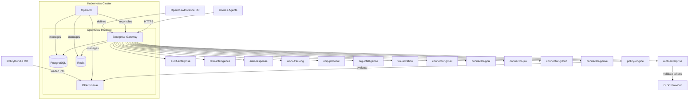

# OpenClaw Enterprise

**Self-hosted, open-source enterprise extension layer for [OpenClaw](https://github.com/szaher/openclaw) — a personal AI assistant.**

OpenClaw Enterprise adds organization-grade capabilities to OpenClaw through a plugin-first architecture. It extends OpenClaw via plugins and a Kubernetes operator without forking upstream, keeping behavior governed by policy engines rather than hardcoded logic.

- [Full Documentation](https://szaher.github.io/openclaw-enterprise/)
- [GitHub Repository](https://github.com/szaher/openclaw-enterprise)

---

## Feature Highlights

- **Plugin-first architecture** — every capability ships as an OpenClaw plugin; upstream is never forked
- **Policy over code** — OPA (Rego) policy engine governs authorization, data classification, and feature access
- **Kubernetes-native** — custom operator with CRDs for declarative management of gateway instances and policy bundles
- **Enterprise authentication** — OIDC/SSO integration with hierarchical RBAC (enterprise > org > team > user)
- **Append-only audit trail** — tamper-evident audit log with query, export, and user-data endpoints
- **Cross-system task intelligence** — discovers tasks across Gmail, Jira, GitHub, Google Calendar, and Google Drive; produces daily briefings
- **Agent-to-agent communication** — OCIP protocol with data classification filtering and loop prevention
- **Auto-response engine** — message classification, auto-reply drafts, and human-in-the-loop approval queue
- **Work tracking** — PR-to-Jira correlation, automatic ticket updates, and standup report generation
- **Org intelligence** — news aggregation, internal doc monitoring, and consistency analysis
- **Interactive visualization** — D3.js dependency graphs, Eisenhower matrices, and mind maps via OpenClaw Canvas

---

## Architecture



---

## Quick Start

### 1. Install CRDs

```bash
kubectl apply -f https://github.com/szaher/openclaw-enterprise/releases/latest/download/crds.yaml
```

### 2. Deploy the Operator

```bash
kubectl apply -f https://github.com/szaher/openclaw-enterprise/releases/latest/download/operator.yaml
```

### 3. Create an OpenClaw Instance

```yaml
apiVersion: openclaw.io/v1alpha1
kind: OpenClawInstance
metadata:
  name: my-instance
  namespace: openclaw-system
spec:
  mode: single
  storage:
    postgres:
      secretRef:
        name: postgres-credentials
    redis:
      secretRef:
        name: redis-credentials
  connectors:
    gmail:
      enabled: true
    jira:
      enabled: true
    github:
      enabled: true
```

```bash
kubectl apply -f instance.yaml
```

For a complete walkthrough, see the [Getting Started guide](https://szaher.github.io/openclaw-enterprise/getting-started/).

---

## Project Structure

```
operator/          -- Go K8s operator (CRDs, controllers, webhooks)
plugins/
  shared/          -- Shared types, constants, errors, health utilities
  policy-engine/   -- OPA client, hierarchy resolver, evaluator, Rego policies
  audit-enterprise/-- Append-only audit writer, query, export
  auth-enterprise/ -- OIDC validator, RBAC mapper, admin API
  connector-gmail/ -- Gmail integration
  connector-gcal/  -- Google Calendar integration
  connector-jira/  -- Jira integration
  connector-github/-- GitHub integration
  connector-gdrive/-- Google Drive integration
  task-intelligence/-- Cross-system task discovery, daily briefings
  auto-response/   -- Message classification, auto-reply, approval queue
  work-tracking/   -- PR-Jira correlation, standup reports
  ocip-protocol/   -- Agent-to-agent communication protocol
  org-intelligence/ -- News aggregation, doc monitoring, consistency
  visualization/   -- D3.js dependency graphs, Eisenhower matrix, mind maps
db/migrations/     -- PostgreSQL schema migrations
docs/              -- MkDocs Material documentation site
examples/          -- Deployment examples and configurations
scripts/           -- Development and CI scripts
```

---

## Custom Resource Definitions

### OpenClawInstance

Represents a deployed gateway instance.

| Field | Description |
|---|---|
| `spec.mode` | Deployment mode: `single` or `ha` |
| `spec.sso` | SSO/OIDC provider configuration |
| `spec.storage` | PostgreSQL and Redis connection references |
| `spec.connectors` | Per-connector enable/disable and credentials |
| `spec.image` | Optional image overrides for gateway and sidecar |

### PolicyBundle

A collection of Rego policies loaded into the OPA sidecar.

| Field | Description |
|---|---|
| `spec.scope` | Policy hierarchy level: `enterprise`, `org`, `team`, or `user` |
| `spec.domains` | Policy domains: `models`, `actions`, `integrations`, `agent-to-agent`, `features`, `data`, `audit` |
| `spec.policies` | Inline or ConfigMap-referenced Rego policy definitions |

---

## Prerequisites

- Node.js >= 22
- pnpm >= 9
- Go >= 1.23 (for operator development)
- PostgreSQL >= 15
- Redis >= 7
- Docker (for container builds)
- kind or minikube (for local Kubernetes testing)
- OPA CLI (optional, for policy testing)

---

## Development Setup

```bash
# Clone the repository
git clone https://github.com/szaher/openclaw-enterprise.git
cd openclaw-enterprise

# Install plugin dependencies
pnpm install

# Build all plugins
pnpm build

# Run tests and lint
npm test && npm run lint
```

### Operator Development

```bash
cd operator

# Install Go dependencies
go mod download

# Run operator tests
go test ./...

# Build the operator binary
go build -o bin/manager cmd/main.go
```

---

## Running Locally with kind

```bash
# Create a local cluster
kind create cluster --name openclaw

# Build and load images into kind
docker build -t openclaw-enterprise/operator:dev -f operator/Dockerfile operator/
docker build -t openclaw-enterprise/gateway:dev -f Dockerfile .
kind load docker-image openclaw-enterprise/operator:dev --name openclaw
kind load docker-image openclaw-enterprise/gateway:dev --name openclaw

# Install CRDs and deploy operator
kubectl apply -f operator/config/crd/bases/
kubectl apply -f operator/config/manager/

# Deploy PostgreSQL and Redis (development only)
kubectl apply -f examples/local/postgres.yaml
kubectl apply -f examples/local/redis.yaml

# Create an instance
kubectl apply -f examples/local/instance.yaml
```

---

## Container Images

All images are multi-arch (amd64 + arm64) and published to GitHub Container Registry.

| Image | Description |
|---|---|
| `ghcr.io/szaher/openclaw-enterprise/operator` | Kubernetes operator |
| `ghcr.io/szaher/openclaw-enterprise/gateway` | Enterprise gateway with all plugins |

Pull a specific version:

```bash
docker pull ghcr.io/szaher/openclaw-enterprise/operator:v0.1.0
docker pull ghcr.io/szaher/openclaw-enterprise/gateway:v0.1.0
```

---

## CI/CD

Three GitHub Actions workflows handle continuous integration and delivery:

| Workflow | Trigger | Purpose |
|---|---|---|
| Operator CI | Push/PR touching `operator/` | Lint, test, and build the Go operator; publish multi-arch image on merge to main |
| Gateway CI | Push/PR touching `plugins/` or `db/` | Lint, test, and build the gateway; publish multi-arch image on merge to main |
| Docs | Push/PR touching `docs/` | Build and deploy MkDocs Material site to GitHub Pages |

Multi-arch builds use QEMU + Docker Buildx. Images are published to GHCR on merge to `main`.

---

## Documentation

Full documentation is available at **[szaher.github.io/openclaw-enterprise](https://szaher.github.io/openclaw-enterprise/)**, covering:

- Getting started and installation
- Plugin development guide
- Policy authoring with Rego
- CRD reference
- Connector configuration
- Architecture decision records (ADRs)

---

## Contributing

Contributions are welcome. Please:

1. Fork the repository
2. Create a feature branch from `main`
3. Ensure all tests pass (`npm test && npm run lint` for plugins, `go test ./...` for operator)
4. Submit a pull request with a clear description of the change

For larger changes, open an issue first to discuss the approach.

See the [Contributing Guide](https://szaher.github.io/openclaw-enterprise/contributing/) for full details.

---

## License

This project is licensed under the [Apache License 2.0](LICENSE).

```
Copyright 2026 OpenClaw Enterprise Contributors

Licensed under the Apache License, Version 2.0 (the "License");
you may not use this file except in compliance with the License.
You may obtain a copy of the License at

    http://www.apache.org/licenses/LICENSE-2.0

Unless required by applicable law or agreed to in writing, software
distributed under the License is distributed on an "AS IS" BASIS,
WITHOUT WARRANTIES OR CONDITIONS OF ANY KIND, either express or implied.
See the License for the specific language governing permissions and
limitations under the License.
```
