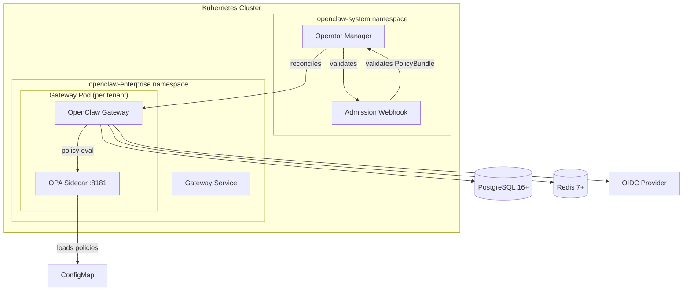

# OpenClaw Enterprise -- Deployment Guide

This guide covers everything needed to deploy, configure, and scale OpenClaw Enterprise on Kubernetes.

## Architecture Overview

OpenClaw Enterprise runs on Kubernetes and is managed by a custom Go operator. Each tenant receives a dedicated OpenClaw gateway instance with an OPA sidecar for policy evaluation. State is stored in PostgreSQL, and Redis provides caching and pub/sub.



## Key Components

| Component | Role | Technology |
|-----------|------|------------|
| Operator | Manages CRDs, reconciles desired state | Go, controller-runtime |
| Gateway | Runs OpenClaw with enterprise plugins | Node.js 22, TypeScript |
| OPA Sidecar | Evaluates policies per request | Open Policy Agent |
| PostgreSQL | Persistent state, audit log, partitioned tables | PostgreSQL 16+ |
| Redis | Caching, session state, pub/sub | Redis 7+ |
| OIDC Provider | SSO authentication | Keycloak, Okta, Azure AD |

## Custom Resources

The operator manages two Custom Resource Definitions:

- **OpenClawInstance** (`oci`) -- Declares a deployed OpenClaw Enterprise instance with auth, storage, replicas, and connector configuration.
- **PolicyBundle** (`pb`) -- Declares a set of Rego policies organized by scope and domain, loaded into the OPA sidecar.

## Deployment Pages

| Page | Description |
|------|-------------|
| [Prerequisites](./prerequisites.md) | Cluster, tooling, and infrastructure requirements |
| [Operator Guide](./operator.md) | Installing and configuring the Kubernetes operator |
| [Configuration Reference](./configuration.md) | Environment variables, CR spec fields, secrets |
| [Scaling and Performance](./scaling.md) | Sizing, load testing, HPA, and monitoring |
| [Compatibility Matrix](./compatibility.md) | Supported versions and breaking change policy |

## Quick Start

1. Verify all [prerequisites](./prerequisites.md) are met.
2. Install the operator CRDs and deployment per the [operator guide](./operator.md).
3. Create Kubernetes Secrets for PostgreSQL, Redis, and OIDC credentials.
4. Apply an `OpenClawInstance` CR to provision a gateway.
5. Apply a `PolicyBundle` CR to load enterprise policies into OPA.
6. Verify the instance reaches the `Running` phase:

```bash
kubectl get openclawinstances -n openclaw-enterprise
```

Expected output:

```
NAME         MODE   REPLICAS   READY   PHASE     AGE
production   ha     3          3       Running   5m
```
