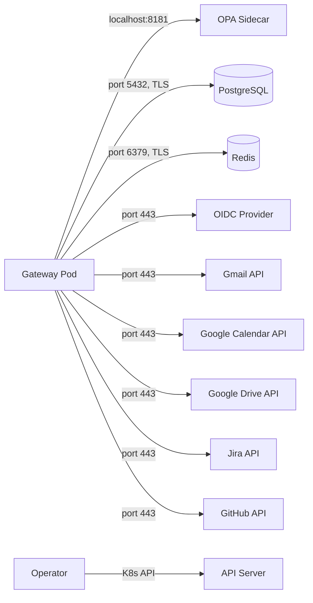

# Prerequisites

This page lists all infrastructure, tooling, and configuration requirements for deploying OpenClaw Enterprise.

## Kubernetes Cluster

A Kubernetes cluster version **1.28 or later** is required. The following managed and self-hosted distributions are supported:

| Distribution | Minimum Version | Notes |
|-------------|----------------|-------|
| Amazon EKS | 1.28 | Managed node groups recommended |
| Google GKE | 1.28 | Autopilot or Standard |
| Azure AKS | 1.28 | System node pool + user node pool |
| Self-hosted (kubeadm, k3s, RKE2) | 1.28 | Ensure CRD v1 and admission webhooks are enabled |

> **Note:** Kubernetes 1.26--1.27 may work but is not tested. Versions below 1.26 are unsupported.

### Required Cluster Features

- Custom Resource Definitions v1 (stable since K8s 1.16)
- Admission webhooks v1 (stable since K8s 1.16)
- RBAC enabled (default on all modern distributions)
- PersistentVolume provisioner (for PostgreSQL if self-hosted)

## CLI Tooling

| Tool | Minimum Version | Purpose |
|------|----------------|---------|
| `kubectl` | Matching cluster version | Cluster management |
| `helm` (optional) | 3.12+ | Helm chart installation (if using Helm-based deployment) |

Ensure `kubectl` is configured with cluster-admin or equivalent access to install CRDs and cluster-scoped RBAC.

## OpenClaw

OpenClaw must be installed and operational on the cluster before deploying the enterprise layer. The enterprise plugins extend OpenClaw via its public plugin API.

| OpenClaw Version | Enterprise Version | Compatibility |
|-----------------|-------------------|---------------|
| 1.x (latest) | 0.1.0 | Supported (development target) |

The following OpenClaw plugin APIs are used:

- `registerTool`
- `registerHook`
- `registerService`
- `registerHttpRoute`
- `registerGatewayMethod`
- `registerContextEngine`

No internal or private OpenClaw APIs are used.

## SSO / OIDC Provider

An OIDC-compliant identity provider must be configured and reachable from the cluster. Supported providers:

| Provider | Configuration Notes |
|----------|-------------------|
| Keycloak | Self-hosted; create a realm and OIDC client |
| Okta | Create an OIDC application; note client ID and secret |
| Azure AD (Entra ID) | Register an app; configure redirect URIs |
| Any OIDC-compliant provider | Must support standard OIDC discovery (`/.well-known/openid-configuration`) |

You will need:

- **OIDC Issuer URL** (e.g., `https://login.example.com/realms/enterprise`)
- **Client ID**
- **Client Secret** (stored as a Kubernetes Secret; never inline in CR specs)

## PostgreSQL

| Requirement | Value |
|------------|-------|
| Version | **16.x** (primary target); 15.x supported; 14.x compatible |
| TLS | Required (`sslmode=verify-full` recommended) |
| Connection Pooling | PgBouncer recommended for production |
| Extensions | None beyond core PostgreSQL |

### PostgreSQL Features Used

- Table partitioning (audit_entries partitioned by month)
- JSONB columns and operators
- Row-level security (planned)
- TLS connections

### Database Sizing

| Scale | Storage | Max Connections (via PgBouncer) |
|-------|---------|---------------------------------|
| 10 users | 10 GB | 20 |
| 100 users | 50 GB | 50 |
| 500 users | 200 GB | 100 |

Create two logical databases (or use separate connection strings):

1. **Primary database** -- application state, connector data, task intelligence
2. **Audit database** -- append-only audit log (can be the same instance with a separate schema, or a dedicated instance for compliance isolation)

## Redis

| Requirement | Value |
|------------|-------|
| Version | **7.x** or later |
| Mode | Standalone for development; **cluster mode for HA** |
| TLS | Recommended for production |
| Persistence | AOF or RDB depending on durability needs |

Redis is used for:

- Session caching
- Connector data caching
- Pub/sub for real-time updates
- Rate limiting state

## OAuth Credentials for Connectors

Each enabled connector requires OAuth credentials from the respective service. Store all credentials as Kubernetes Secrets.

| Connector | Credentials Required |
|-----------|---------------------|
| Gmail | Google OAuth 2.0 client ID and secret, service account key |
| Google Calendar | Same Google OAuth credentials as Gmail |
| Google Drive | Same Google OAuth credentials as Gmail |
| Jira | Atlassian API token or OAuth 2.0 app credentials |
| GitHub | GitHub App private key, app ID, and installation ID; or OAuth app credentials |

## Minimum Resource Requirements

### Small (up to 10 users)

Suitable for evaluation and development.

| Component | CPU Request | CPU Limit | Memory Request | Memory Limit | Replicas |
|-----------|-----------|-----------|---------------|-------------|----------|
| Operator | 100m | 500m | 128Mi | 256Mi | 1 |
| Gateway | 250m | 1 | 256Mi | 512Mi | 1 |
| OPA Sidecar | 100m | 500m | 128Mi | 256Mi | 1 (per gateway pod) |
| PostgreSQL | 500m | 2 | 1Gi | 2Gi | 1 |
| Redis | 250m | 1 | 256Mi | 512Mi | 1 |

**Total cluster minimum:** 2 vCPU, 4 GB RAM, 20 GB storage

### Medium (up to 100 users)

Suitable for team or department deployments.

| Component | CPU Request | CPU Limit | Memory Request | Memory Limit | Replicas |
|-----------|-----------|-----------|---------------|-------------|----------|
| Operator | 100m | 500m | 128Mi | 256Mi | 1 |
| Gateway | 500m | 2 | 512Mi | 1Gi | 2 |
| OPA Sidecar | 250m | 1 | 256Mi | 512Mi | 1 (per gateway pod) |
| PostgreSQL | 2 | 4 | 4Gi | 8Gi | 1 (+ read replica) |
| Redis | 500m | 2 | 512Mi | 1Gi | 3 (cluster) |
| PgBouncer | 100m | 500m | 64Mi | 128Mi | 1 |

**Total cluster minimum:** 8 vCPU, 16 GB RAM, 100 GB storage

### Large (up to 500 users)

Production-grade high-availability deployment.

| Component | CPU Request | CPU Limit | Memory Request | Memory Limit | Replicas |
|-----------|-----------|-----------|---------------|-------------|----------|
| Operator | 200m | 1 | 256Mi | 512Mi | 2 (leader election) |
| Gateway | 1 | 4 | 1Gi | 2Gi | 3+ |
| OPA Sidecar | 500m | 1 | 256Mi | 512Mi | 1 (per gateway pod) |
| PostgreSQL | 4 | 8 | 8Gi | 16Gi | 1 primary + 2 read replicas |
| Redis | 1 | 2 | 1Gi | 2Gi | 6 (cluster, 3 masters + 3 replicas) |
| PgBouncer | 250m | 1 | 128Mi | 256Mi | 2 |

**Total cluster minimum:** 24 vCPU, 48 GB RAM, 500 GB storage

## Network Requirements

The following network connectivity is required between components:

| Source | Destination | Port | Protocol | Notes |
|--------|------------|------|----------|-------|
| Gateway | OPA Sidecar | 8181 | HTTP | localhost (same pod) |
| Gateway | PostgreSQL | 5432 | TCP + TLS | Connection pooler if using PgBouncer |
| Gateway | Redis | 6379 | TCP + TLS | All cluster nodes if Redis cluster mode |
| Gateway | OIDC Provider | 443 | HTTPS | Token validation and user info |
| Gateway | Connector APIs | 443 | HTTPS | Gmail, Calendar, Drive, Jira, GitHub |
| Operator | K8s API Server | 443/6443 | HTTPS | CRD management, watch, status updates |
| Operator Webhook | K8s API Server | 9443 | HTTPS | Admission webhook callback |

### Firewall and Egress

- The gateway pods require **egress to the internet** (or a proxy) for connector API access and OIDC provider communication.
- If using a network policy, ensure the OPA sidecar port (8181) is allowed within the pod (loopback).
- The operator requires access to the Kubernetes API server only; no external egress is needed.

### DNS

- All external services (OIDC provider, connector APIs) must be resolvable from within the cluster.
- Internal services use Kubernetes DNS (e.g., `production-gateway.openclaw-enterprise.svc.cluster.local`).
