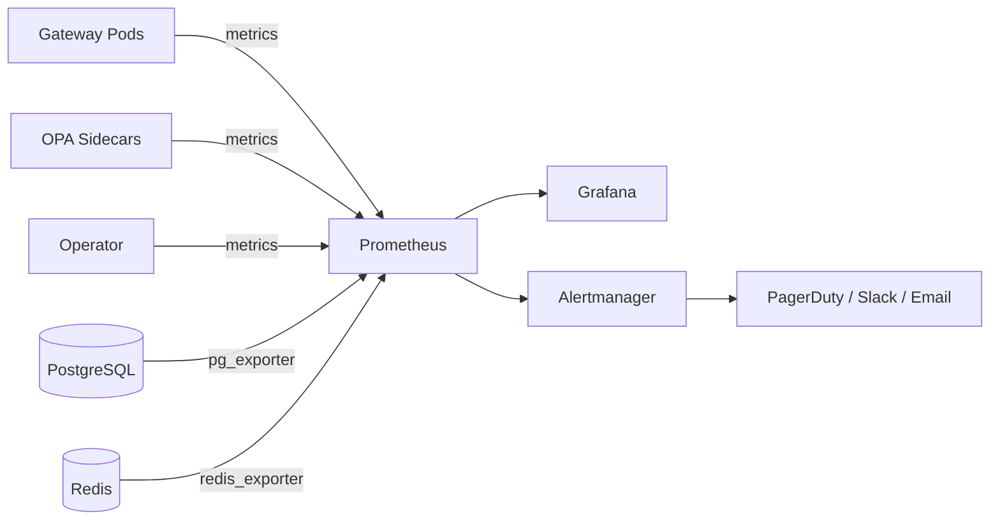

# Scaling and Performance

This page covers scaling targets, load test plans, sizing recommendations, and monitoring guidance for OpenClaw Enterprise deployments.

## Scaling Target

OpenClaw Enterprise is designed to support **500 concurrent users** per deployment with acceptable response times across all operations.

## Performance Targets

| Operation | Target | Notes |
|-----------|--------|-------|
| Policy hot-reload | < 60 seconds | Time from PolicyBundle CR update to OPA reflecting new policies |
| Audit queries | < 10 seconds | Complex queries across partitioned audit tables |
| Briefing generation | Within cron window | Depends on configured schedule; default 30-minute windows |
| Auto-response classification + response | < 30 seconds | End-to-end from message receipt to response dispatch |
| Policy evaluation (per call) | < 100ms (P95) | Single OPA policy evaluation via REST API |

## Load Test Plan

The load test plan validates that the system meets performance targets under full load. Tests use [k6](https://k6.io/) for HTTP load generation and a custom harness for WebSocket/sessions_send testing. Metrics are collected via Prometheus and visualized in Grafana.

### Test Environment

| Component | Configuration |
|-----------|--------------|
| Gateway Replicas | 3 (minimum HA configuration) |
| OPA Sidecars | 1 per gateway pod |
| PostgreSQL | 16.x with PgBouncer connection pooling |
| Redis | 7.x cluster mode |
| Cluster | Production-equivalent K8s cluster |

### Scenario 1: Briefing Generation Under Load

| Parameter | Value |
|-----------|-------|
| Concurrent Users | 500 |
| Action | Each user triggers `generate_briefing` simultaneously |
| Pass Criteria | P95 < 30s, P99 < 60s, zero errors |

This scenario validates that the briefing generation pipeline (task scanner, correlator, scorer) can handle all users requesting briefings at the same time, such as during a morning start-of-day spike.

### Scenario 2: Policy Evaluation Throughput

| Parameter | Value |
|-----------|-------|
| Concurrent Users | 500 |
| Action | Each user triggers 10 tool invocations (5,000 total `policy.evaluate` calls) |
| Pass Criteria | P95 < 100ms, P99 < 500ms |

This scenario validates that the OPA sidecar can handle burst policy evaluation load without becoming a bottleneck.

### Scenario 3: Audit Log Write Throughput

| Parameter | Value |
|-----------|-------|
| Concurrent Users | 500 |
| Action | Each action generates an audit entry (5,000+ writes) |
| Pass Criteria | Zero dropped entries, P95 write < 50ms |

This scenario validates the append-only audit writer under sustained write pressure. No audit entries may be dropped under any circumstances.

### Scenario 4: Connector Read Burst

| Parameter | Value |
|-----------|-------|
| Concurrent Users | 100 (connector rate limits apply) |
| Action | Each user reads from all 5 connectors simultaneously |
| Pass Criteria | No crashes, rate-limited requests queued or retried |

This scenario validates graceful degradation when external connector API rate limits are hit. The system must not crash or lose data; requests should be queued and retried.

### Scenario 5: Mixed Workload (Realistic)

| Parameter | Value |
|-----------|-------|
| Concurrent Users | 500 |
| Duration | 30 minutes sustained |
| Error Rate Target | < 0.1% |

Workload distribution:

| Activity | Percentage |
|----------|-----------|
| Reading briefings/tasks | 40% |
| Triggering auto-responses | 25% |
| Querying audit log | 20% |
| Admin operations (policy CRUD) | 10% |
| OCIP agent-to-agent exchanges | 5% |

**Pass criteria:** Error rate < 0.1%, P95 < 5s for reads, P95 < 10s for writes.

### Load Test Results Template

Results will be recorded after execution against a production-equivalent environment:

| Scenario | P50 | P95 | P99 | Error Rate | Status |
|----------|-----|-----|-----|------------|--------|
| Briefing Generation | -- | -- | -- | -- | Not run |
| Policy Evaluation | -- | -- | -- | -- | Not run |
| Audit Write | -- | -- | -- | -- | Not run |
| Connector Burst | -- | -- | -- | -- | Not run |
| Mixed Workload | -- | -- | -- | -- | Not run |

## Scaling Recommendations

### Gateway Pod Replicas

| Deployment Size | Minimum Replicas | Recommended | Notes |
|----------------|-----------------|-------------|-------|
| Development | 1 | 1 | `deploymentMode: single` |
| Small (< 50 users) | 2 | 2 | Basic redundancy |
| Production (< 500 users) | 3 | 3--5 | `deploymentMode: ha` |
| Large (500+ users) | 3 | 5+ | Use HPA (see below) |

Set replicas in the OpenClawInstance CR:

```yaml
spec:
  deploymentMode: ha
  replicas: 3
```

### Database Connection Pooling (PgBouncer)

PgBouncer is strongly recommended for production deployments to prevent connection exhaustion.

| Scale | `max_client_conn` | `default_pool_size` | `reserve_pool_size` |
|-------|-------------------|--------------------|--------------------|
| 10 users | 100 | 10 | 5 |
| 100 users | 200 | 25 | 10 |
| 500 users | 500 | 50 | 20 |

Example PgBouncer configuration:

```ini
[databases]
openclaw = host=postgres-primary port=5432 dbname=openclaw

[pgbouncer]
listen_addr = 0.0.0.0
listen_port = 6432
auth_type = scram-sha-256
pool_mode = transaction
max_client_conn = 500
default_pool_size = 50
reserve_pool_size = 20
server_tls_sslmode = verify-full
server_tls_ca_file = /etc/ssl/certs/pg-ca.crt
```

### Redis Cluster Sizing

| Scale | Nodes | Memory per Node | Max Connections |
|-------|-------|----------------|----------------|
| 10 users | 1 (standalone) | 256Mi | 100 |
| 100 users | 3 (cluster) | 512Mi | 500 |
| 500 users | 6 (3 masters + 3 replicas) | 1Gi | 2000 |

### OPA Sidecar Resource Limits

The OPA sidecar runs in the same pod as each gateway replica. Adjust resource limits based on policy complexity and evaluation frequency.

| Scale | CPU Request | CPU Limit | Memory Request | Memory Limit |
|-------|-----------|-----------|---------------|-------------|
| Small (< 50 users) | 100m | 500m | 128Mi | 256Mi |
| Medium (< 200 users) | 250m | 1 | 256Mi | 512Mi |
| Large (500 users) | 500m | 1 | 256Mi | 512Mi |

> **Note:** OPA's memory usage is primarily driven by the number and complexity of loaded policies, not by query throughput. Monitor actual usage and adjust accordingly.

### Horizontal Pod Autoscaler (HPA)

For production deployments, configure an HPA to automatically scale gateway pods based on CPU and memory utilization.

```yaml
apiVersion: autoscaling/v2
kind: HorizontalPodAutoscaler
metadata:
  name: production-gateway-hpa
  namespace: openclaw-enterprise
spec:
  scaleTargetRef:
    apiVersion: apps/v1
    kind: Deployment
    name: production-gateway
  minReplicas: 3
  maxReplicas: 10
  metrics:
    - type: Resource
      resource:
        name: cpu
        target:
          type: Utilization
          averageUtilization: 70
    - type: Resource
      resource:
        name: memory
        target:
          type: Utilization
          averageUtilization: 80
  behavior:
    scaleUp:
      stabilizationWindowSeconds: 60
      policies:
        - type: Pods
          value: 2
          periodSeconds: 60
    scaleDown:
      stabilizationWindowSeconds: 300
      policies:
        - type: Pods
          value: 1
          periodSeconds: 120
```

Key HPA settings:

| Setting | Value | Rationale |
|---------|-------|-----------|
| `minReplicas` | 3 | Minimum for HA |
| `maxReplicas` | 10 | Cap to prevent runaway scaling |
| CPU target | 70% | Scale before saturation |
| Memory target | 80% | Memory is less spiky than CPU |
| Scale-up window | 60s | React quickly to load increases |
| Scale-down window | 300s | Avoid flapping during variable load |

### Pod Disruption Budget

To maintain availability during voluntary disruptions (node upgrades, cluster scaling):

```yaml
apiVersion: policy/v1
kind: PodDisruptionBudget
metadata:
  name: production-gateway-pdb
  namespace: openclaw-enterprise
spec:
  minAvailable: 2
  selector:
    matchLabels:
      app.kubernetes.io/name: openclaw-enterprise
      app.kubernetes.io/instance: production
      app.kubernetes.io/component: gateway
```

## Metrics to Monitor

### Application Metrics

| Metric | Target | Alert Threshold |
|--------|--------|----------------|
| Request throughput (req/s) | > 1,000 | < 500 sustained |
| P50 response time | < 500ms | > 1s sustained |
| P95 response time | < 5s | > 10s sustained |
| P99 response time | < 15s | > 30s sustained |
| Error rate | < 0.1% | > 1% sustained |

### Infrastructure Metrics

| Metric | Target | Alert Threshold |
|--------|--------|----------------|
| Gateway CPU utilization | < 70% | > 85% sustained for 5m |
| Gateway memory utilization | < 80% | > 90% sustained for 5m |
| OPA sidecar CPU | < 50% | > 80% sustained for 5m |
| OPA sidecar memory | < 70% | > 85% sustained for 5m |

### Database Metrics

| Metric | Target | Alert Threshold |
|--------|--------|----------------|
| DB connection pool utilization | < 70% | > 85% sustained |
| DB query P95 latency | < 100ms | > 500ms sustained |
| DB active connections | < `default_pool_size` | > 80% of pool size |
| DB disk usage | < 80% of provisioned | > 85% of provisioned |

### Business Metrics

| Metric | Target | Alert Threshold |
|--------|--------|----------------|
| Audit entry completeness | 100% | Any gap |
| Policy evaluation success rate | 100% | Any failure |
| Connector sync success rate | > 99% | < 95% over 1 hour |

### Recommended Monitoring Stack



Use the following exporters:

| Exporter | Target |
|----------|--------|
| kube-state-metrics | Kubernetes resource state |
| node-exporter | Node-level CPU, memory, disk |
| postgres_exporter | PostgreSQL connection pool, query stats |
| redis_exporter | Redis memory, connections, command stats |
| OPA built-in metrics | Policy evaluation latency and counts |
