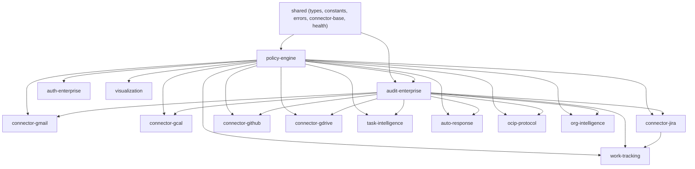

# Plugin Architecture

OpenClaw Enterprise is built entirely as plugins on top of the OpenClaw platform. This document explains the architecture, the plugin API, the dependency graph, and how plugins communicate with each other.

## Everything Is a Plugin

The first principle in the project constitution is **Upstream First**: we extend OpenClaw via plugins; we never fork it. Every enterprise capability -- policy evaluation, audit logging, connectors, task intelligence, auto-response -- is implemented as an OpenClaw plugin.

If a capability cannot be built as a plugin, the design must be reworked or the required extension point must be proposed upstream. There are no exceptions.

## The OpenClaw Plugin API

Every plugin exports an `activate(api)` function that receives an `OpenClawPluginAPI` object. This API provides six registration methods:

### registerTool

Adds a tool that the AI agent can invoke. Tools appear in the agent's tool list and can be called during conversations.

```typescript
api.registerTool({
  name: 'email_read',
  description: 'Fetch a specific email by message ID from Gmail.',
  parameters: {
    type: 'object',
    properties: {
      messageId: { type: 'string', description: 'The Gmail message ID to fetch' },
    },
    required: ['messageId'],
  },
  execute: async (params) => {
    // Tool implementation
  },
});
```

### registerHook

Attaches logic to lifecycle events in the OpenClaw runtime. Hooks fire at defined points such as `before_model_resolve`, `before_prompt_build`, or `sessions_send`.

```typescript
api.registerHook({
  event: 'before_tool_execute',
  priority: 10,
  handler: async (context) => {
    // Evaluate policy before any tool runs
    const result = await evaluator.evaluate(context);
    if (result.decision === 'deny') {
      throw new PolicyDeniedError(context.tool, result.policyApplied, result.reason);
    }
  },
});
```

### registerService

Registers a long-running background service with start/stop lifecycle management and health checks.

```typescript
api.registerService({
  name: 'policy-hot-reload',
  start: () => watcher.start(),
  stop: () => watcher.stop(),
  healthCheck: () => watcher.healthCheck(),
});
```

### registerHttpRoute

Exposes a REST endpoint under the gateway's HTTP server. All enterprise admin APIs use this registration method.

```typescript
api.registerHttpRoute({
  method: 'GET',
  path: '/api/v1/audit',
  handler: async (req, res) => {
    // Handle HTTP request
  },
});
```

### registerGatewayMethod

Registers a method that other plugins can call through the gateway's inter-plugin communication system. This is the primary mechanism for plugin-to-plugin interaction.

```typescript
api.registerGatewayMethod({
  name: 'policy.evaluate',
  handler: async (params) => evaluator.evaluate(params),
});
```

### registerContextEngine

Injects context into the agent's prompt construction pipeline. Context engines provide additional information that the agent sees when building its response.

```typescript
api.registerContextEngine({
  name: 'enterprise-context',
  provide: async (session) => {
    return { policies: activePolicies, userScope: session.user.scope };
  },
});
```

## Plugin + Skill Pairs

Every plugin has a paired `SKILL.md` file. The plugin registers tools, services, hooks, and routes (the platform capability). The skill teaches the agent when and how to use them (the behavioral instructions).

Neither is complete without the other:

- A plugin without a skill provides tools the agent does not know how to use.
- A skill without a plugin references tools that do not exist.

The `SKILL.md` lives at the root of each plugin directory:

```
plugins/connector-gmail/
  src/plugin.ts      # Platform capability
  SKILL.md           # Agent instructions
```

## Dependency Graph

All plugins depend on `shared` for types, constants, and error classes. All plugins (except `shared` itself) depend on `policy-engine` for policy evaluation and data classification. The dependency graph flows in one direction:



> **Note:** Arrows point from dependency to dependent. Every connector and feature plugin depends on both `policy-engine` and `audit-enterprise` via GatewayMethods (`policy.evaluate`, `policy.classify`, `audit.log`).

## GatewayMethods: Inter-Plugin Communication

Plugins do not call each other directly. All inter-plugin communication goes through GatewayMethods -- named methods registered by one plugin and invoked by others through the gateway event system.

### Core GatewayMethods

| Method | Registered By | Purpose |
|---|---|---|
| `policy.evaluate` | policy-engine | Evaluate a policy decision (allow/deny/require_approval) |
| `policy.classify` | policy-engine | Classify data by sensitivity level |
| `audit.log` | audit-enterprise | Write an immutable audit log entry |
| `audit.query` | audit-enterprise | Query audit log entries with filters |
| `auto-response.listPending` | auto-response | List pending approval queue items |
| `auto-response.approve` | auto-response | Approve a pending auto-response |
| `auto-response.reject` | auto-response | Reject a pending auto-response |
| `auto-response.getSummary` | auto-response | Get auto-response summary for briefings |
| `auto-response.updateScopeConfig` | auto-response | Update scope configuration from policy |

### GatewayMethods Type Interface

The `GatewayMethods` interface in `plugins/shared/src/connector-base.ts` defines the type contract for the core gateway methods that every connector uses:

```typescript
export interface GatewayMethods {
  'policy.evaluate': (params: PolicyEvaluateRequest) => Promise<PolicyEvaluateResponse>;
  'policy.classify': (params: ClassifyRequest) => Promise<ClassifyResponse>;
  'audit.log': (params: Record<string, unknown>) => Promise<{ id: string }>;
}
```

### Usage Pattern

A plugin calls a GatewayMethod through the injected gateway object:

```typescript
const result = await gateway['policy.evaluate']({
  tenantId: 'acme-corp',
  userId: 'user-123',
  action: 'email_read',
  context: {
    dataClassification: 'internal',
    targetSystem: 'gmail',
  },
});

if (result.decision === 'deny') {
  // Handle denial
}
```

## Plugin Lifecycle

Every plugin goes through a defined lifecycle:

1. **Load** -- The runtime discovers and loads the plugin module.
2. **Initialize** -- The `activate(api)` function is called with the plugin API.
3. **Register** -- The plugin registers its tools, hooks, services, routes, gateway methods, and context engines.
4. **Running** -- Services are started. Tools are available to the agent. Hooks fire on lifecycle events. HTTP routes accept requests.
5. **Shutdown** -- Services are stopped gracefully. Resources are cleaned up.

The policy-engine plugin loads first, followed by audit-enterprise, then all other plugins. This ordering ensures that policy evaluation and audit logging are available before any other plugin attempts to use them.

## The 15 Enterprise Plugins

| Plugin | Purpose | Key Registrations |
|---|---|---|
| **policy-engine** | Central policy authority; OPA evaluation, hierarchy resolution, classification, hot-reload | GatewayMethods: `policy.evaluate`, `policy.classify`. Hook: `before_tool_execute`. Service: `policy-hot-reload`. |
| **audit-enterprise** | Append-only audit logging, query, export | GatewayMethods: `audit.log`, `audit.query`. HTTP routes: `/api/v1/audit`. |
| **auth-enterprise** | SSO/OIDC validation, RBAC mapping, admin API | HTTP routes: `/api/v1/auth/*`. |
| **connector-gmail** | Gmail integration (read, search, inbox polling) | Tools: `email_read`, `email_search`. Service: `gmail-inbox-poller`. |
| **connector-gcal** | Google Calendar integration | Tools: `calendar_list`, `calendar_search`. Service: `gcal-poller`. |
| **connector-jira** | Jira integration (read, write, webhook) | Tools: `jira_read`, `jira_search`, `jira_update`. |
| **connector-github** | GitHub integration (PRs, issues, commits) | Tools: `github_pr_list`, `github_issue_search`. |
| **connector-gdrive** | Google Drive integration | Tools: `gdrive_search`, `gdrive_read`. |
| **task-intelligence** | Cross-system task discovery, correlation, prioritization, briefing | Tools: `task_list`, `daily_briefing`. Services: task scanner, correlator. |
| **auto-response** | Message classification, policy-governed auto-responses, approval queue | Hook: incoming message classification. GatewayMethods: approval queue. HTTP routes: `/api/v1/auto-response/*`. |
| **work-tracking** | PR-to-Jira correlation, ticket auto-update, standup generation | Tools: `standup_summary`. Hooks: GitHub webhook events. |
| **ocip-protocol** | Agent-to-agent exchanges (OCIP envelope, classification filter, loop prevention) | Hooks: `sessions_send` (outgoing/incoming OCIP envelope). |
| **org-intelligence** | News aggregation, document monitoring, consistency checking | Tools: org news, doc change alerts. |
| **visualization** | D3.js dependency graphs, Eisenhower matrix, mind maps via Canvas | Tools: visualization rendering. |

## Project Structure

Each plugin follows a consistent directory structure:

```
plugins/{name}/
  src/
    plugin.ts           # Entry point: activate(api) function
    openclaw-types.ts   # OpenClawPluginAPI type definition (local)
    tools/              # Tool implementations
      read.ts
      write.ts
    services/           # Background service implementations
      poller.ts
    hooks.ts            # Hook implementations
    routes.ts           # HTTP route handlers
  tests/
    {name}.test.ts      # Vitest unit tests
  SKILL.md              # Paired skill for the agent
  README.md             # Plugin documentation
  package.json          # pnpm workspace package
  tsconfig.json         # Extends tsconfig.base.json
```

The shared library has a simpler structure:

```
plugins/shared/
  src/
    types.ts            # All shared type definitions
    constants.ts        # Shared constants
    errors.ts           # Error class hierarchy
    connector-base.ts   # ConnectorBase abstract class + GatewayMethods
    health.ts           # Health check utilities
    index.ts            # Re-exports
  package.json
  tsconfig.json
```

The K8s operator is a separate Go project:

```
operator/
  api/v1/
    types.go            # CRD type definitions (OpenClawInstance, PolicyBundle)
    groupversion_info.go
    zz_generated.deepcopy.go
  internal/
    controller/
      instance_controller.go
      policy_controller.go
    webhook/
      policy_webhook.go
  cmd/manager/
    main.go
  tests/
    instance_controller_test.go
    policy_controller_test.go
```
