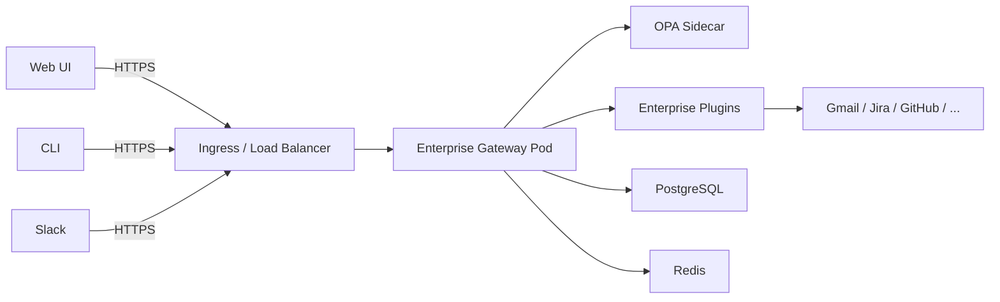
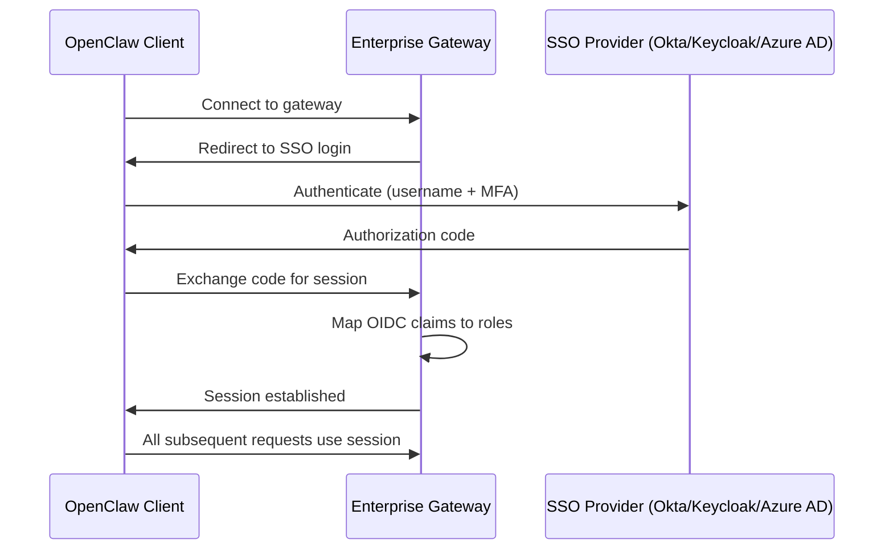

# Accessing OpenClaw Enterprise

After deploying your OpenClaw Enterprise instance on Kubernetes, this page explains how to install the client, connect to the enterprise gateway, and start using enterprise features.

## How It Works

OpenClaw is a personal AI assistant with multiple interfaces — a **web UI**, a **CLI**, and **messaging integrations** (Slack). All interfaces communicate through a **gateway** that processes requests, runs tools, and manages conversations.

In a standalone setup, the gateway runs locally. In an enterprise deployment, the gateway runs on Kubernetes with enterprise plugins loaded — and users point their OpenClaw client at the enterprise gateway instead.



The enterprise gateway is a standard OpenClaw Gateway with additional plugins installed. Everything that makes it "enterprise" — policy enforcement, audit logging, connectors, OCIP — comes from the plugins. Your OpenClaw client does not need any modifications.

## User Interfaces

OpenClaw provides three ways to interact with your assistant:

| Interface | Description | Best For |
|-----------|-------------|----------|
| **Web UI** | Browser-based chat interface with Canvas support for visualizations | Day-to-day use, viewing briefings, interactive graphs and mind maps |
| **CLI** | Terminal-based interface (`openclaw` command) | Developers, scripting, automation, quick queries |
| **Slack** | Chat with your assistant directly in Slack via the ChannelPlugin | Teams already using Slack, auto-response, receiving briefings |

All three interfaces connect to the same enterprise gateway and share the same session, policies, and audit trail. Visualizations (D3.js dependency graphs, Eisenhower matrices, mind maps) render in the **Web UI** via OpenClaw's Canvas (A2UI) system.

!!! info "API access"
    Administrators can also interact directly with the enterprise REST API (`/api/v1/*`) for policy management, audit queries, connector administration, and system monitoring. There is no standalone admin dashboard UI in the current release — admin operations are API-first, and a dashboard can be built on top of the API.

## Deployment Model: Shared, Not Per-User

A common question: **do I need an instance per user?** No. A single `OpenClawInstance` serves all users within a tenant.

| Model | What gets deployed | Users served | When to use |
|-------|-------------------|--------------|-------------|
| **Shared** (default) | One gateway (with replicas) per tenant | All users in the tenant (up to 500 concurrent) | Most deployments |
| **Per-user** | Dedicated gateway per user | One user | High-isolation requirements (regulated roles, exec team) |

In a shared deployment, users are distinguished by their SSO identity. The policy hierarchy (enterprise > org > team > user) ensures each user gets the right permissions, connector access, and autonomy levels — all from the same gateway.

For example, a 200-person engineering organization deploys **one** `OpenClawInstance` with 3 replicas — not 200 instances. The operator scales replicas based on load.

!!! tip
    Start with shared mode. Per-user mode is only needed when you require full process-level isolation between users, which is rare outside of highly regulated environments.

## Step 1: Install the OpenClaw Client

Before connecting to the enterprise gateway, each user needs the OpenClaw client installed on their machine.

### Web UI (Recommended for most users)

The web UI is served directly by the enterprise gateway — no client installation required. Once the gateway is exposed (Step 2), users simply open the gateway URL in their browser:

```
https://openclaw.internal.company.com
```

They will be redirected to SSO login and then land in the chat interface.

### CLI

For developers and power users, install the OpenClaw CLI:

=== "macOS (Homebrew)"

    ```bash
    brew install openclaw
    ```

=== "Linux (apt)"

    ```bash
    curl -fsSL https://szaher.github.io/openclaw-enterprise/install/gpg | sudo gpg --dearmor -o /usr/share/keyrings/openclaw.gpg
    echo "deb [signed-by=/usr/share/keyrings/openclaw.gpg] https://szaher.github.io/openclaw-enterprise/install/apt stable main" | \
      sudo tee /etc/apt/sources.list.d/openclaw.list
    sudo apt update && sudo apt install openclaw
    ```

=== "Linux (binary)"

    ```bash
    curl -fsSL https://szaher.github.io/openclaw-enterprise/install/install.sh | sh
    ```

=== "npm"

    ```bash
    npm install -g @openclaw-enterprise/cli
    ```

Verify the installation:

```bash
openclaw --version
```

### Slack Integration

To enable Slack as an interface, configure the OpenClaw Slack ChannelPlugin in your workspace:

1. Create a Slack App in your workspace's admin console
2. Configure the app's event subscription URL to point at the enterprise gateway:
   ```
   https://openclaw.internal.company.com/api/v1/channels/slack/events
   ```
3. Add the required bot scopes: `chat:write`, `channels:history`, `im:history`, `users:read`
4. Install the app to your workspace
5. Users interact with the assistant by messaging the Slack bot directly or mentioning it in channels

!!! note "Slack is provided by OpenClaw core"
    The Slack ChannelPlugin is a built-in OpenClaw feature, not an enterprise plugin. Enterprise features (auto-response, OCIP agent-to-agent exchanges, policy enforcement) work transparently on top of it.

## Step 2: Expose the Gateway

After deploying an `OpenClawInstance` CR, the operator creates gateway pods. You need to expose them to your network.

### Using an Ingress

```yaml
apiVersion: networking.k8s.io/v1
kind: Ingress
metadata:
  name: openclaw-gateway
  namespace: openclaw-system
  annotations:
    nginx.ingress.kubernetes.io/ssl-redirect: "true"
    nginx.ingress.kubernetes.io/backend-protocol: "HTTPS"
spec:
  ingressClassName: nginx
  tls:
    - hosts:
        - openclaw.internal.company.com
      secretName: openclaw-tls
  rules:
    - host: openclaw.internal.company.com
      http:
        paths:
          - path: /
            pathType: Prefix
            backend:
              service:
                name: openclaw-gateway
                port:
                  number: 443
```

### Using a LoadBalancer Service

For simpler setups or cloud environments:

```yaml
apiVersion: v1
kind: Service
metadata:
  name: openclaw-gateway-lb
  namespace: openclaw-system
spec:
  type: LoadBalancer
  selector:
    app: openclaw-gateway
  ports:
    - port: 443
      targetPort: 8443
      protocol: TCP
```

!!! note
    For production, always use TLS. The gateway should be accessible only over HTTPS, especially since it handles OAuth tokens and sensitive enterprise data.

## Step 3: Authenticate via SSO

OpenClaw Enterprise requires SSO/OIDC authentication — there is no password-based login. When you first connect, you will be redirected to your identity provider.

### Authentication Flow



The gateway maps your OIDC claims to one of four built-in roles:

| Role | Typical OIDC Group | Capabilities |
|------|-------------------|--------------|
| `enterprise_admin` | `openclaw-admins` | Full access: policies, audit, all tenants |
| `org_admin` | `openclaw-org-admins` | Manage policies and audit within their org |
| `team_lead` | `openclaw-team-leads` | Manage team-level policies |
| `user` | `openclaw-users` | Use the assistant, view own activity |

## Step 4: Configure Your OpenClaw Client

Point your OpenClaw client at the enterprise gateway URL.

### CLI Configuration

```bash
# Set the enterprise gateway URL
openclaw config set gateway_url https://openclaw.internal.company.com

# Authenticate (opens browser for SSO)
openclaw auth login
```

### Environment Variables

Alternatively, configure via environment variables:

```bash
export OPENCLAW_GATEWAY_URL=https://openclaw.internal.company.com
export OPENCLAW_AUTH_METHOD=oidc
```

### Configuration File

Or in your OpenClaw configuration file (`~/.openclaw/config.yaml`):

```yaml
gateway:
  url: https://openclaw.internal.company.com
  auth:
    method: oidc
    # Token is managed automatically after login
```

## Step 5: Verify the Connection

Once connected, verify that enterprise features are active:

```bash
# Check connection status
openclaw status
```

Expected output:

```
Gateway:     https://openclaw.internal.company.com
Status:      Connected
User:        alice@company.com
Role:        org_admin
Tenant:      acme-corp
Org Unit:    engineering

Enterprise Plugins:
  policy-engine       active
  audit-enterprise    active
  auth-enterprise     active
  connector-gmail     active
  connector-gcal      active
  connector-jira      active
  connector-github    active
  connector-gdrive    active
  task-intelligence   active
  auto-response       active
  work-tracking       active
  ocip-protocol       active
  org-intelligence    active
  visualization       active
```

You can also verify via the API:

```bash
# Get your user info
curl -s -H "Authorization: Bearer $TOKEN" \
  https://openclaw.internal.company.com/api/v1/auth/userinfo | jq .

# Check system status
curl -s https://openclaw.internal.company.com/api/v1/status | jq .

# List active connectors
curl -s -H "Authorization: Bearer $TOKEN" \
  https://openclaw.internal.company.com/api/v1/connectors | jq .
```

## What Changes for Users

Once connected to the enterprise gateway, the OpenClaw assistant gains enterprise capabilities transparently:

| Feature | Standalone OpenClaw | Enterprise OpenClaw |
|---------|-------------------|-------------------|
| Tool execution | Unrestricted | Policy-governed (every action checked) |
| Data handling | Local only | Classification-enforced (public/internal/confidential/restricted) |
| Model routing | User choice | Policy-controlled (sensitive data routed to self-hosted models) |
| Audit trail | None | Every action logged immutably |
| Connectors | Manual setup | Centrally managed (Gmail, Jira, GitHub, GCal, GDrive) |
| Daily briefings | Not available | Cross-system task discovery and prioritization |
| Auto-response | Not available | Policy-governed message classification and response |
| Agent-to-agent | Not available | OCIP protocol with classification filtering |

!!! info "Transparent to the user"
    Users interact with OpenClaw the same way they always have — by chatting with the assistant. The enterprise plugins work behind the scenes. The policy engine evaluates every action before execution. The audit log captures everything. Connectors provide data from enterprise systems. The user experience is the same, but with governance, security, and intelligence layered on top.

## Multiple Tenants

In a multi-tenant deployment, each tenant gets its own gateway instance. Users are routed to their tenant's gateway based on their SSO identity:

- **Separate URLs**: `https://engineering.openclaw.company.com`, `https://sales.openclaw.company.com`
- **Path-based routing**: `https://openclaw.company.com/engineering/`, `https://openclaw.company.com/sales/`
- **Automatic routing**: The ingress controller routes based on OIDC claims after authentication

The K8s operator manages all gateway instances. Each tenant has independent policies, connectors, and audit logs — fully isolated.

## Troubleshooting

| Issue | Cause | Solution |
|-------|-------|----------|
| "Connection refused" | Gateway not exposed | Check Ingress/LoadBalancer and service |
| "SSO redirect loop" | OIDC misconfiguration | Verify issuer URL and client ID in OpenClawInstance CR |
| "403 Forbidden" | Missing role mapping | Check OIDC claims and role mapping in auth config |
| "No enterprise plugins" | Plugins not loaded | Check gateway pod logs: `kubectl logs -n openclaw-system -l app=openclaw-gateway` |
| "Policy engine unreachable" | OPA sidecar down | Check OPA container: `kubectl logs -n openclaw-system -l app=openclaw-gateway -c opa` |
| Connector shows "error" | Invalid OAuth credentials | Verify K8s Secret contents and re-authenticate the connector |

## Next Steps

- [Configure connectors](../how-to/configure-gmail.md) to connect your enterprise systems
- [Write policies](../how-to/write-policies.md) to govern assistant behavior
- [Enable auto-response](../how-to/enable-auto-response.md) for automated message handling
- Review the [User Guide](../user-guide/index.md) for day-to-day feature usage
