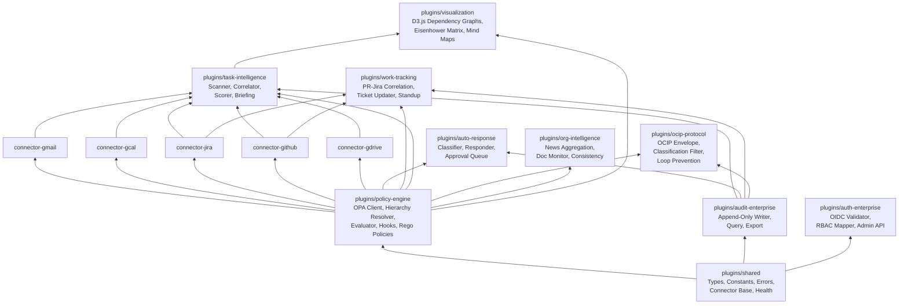
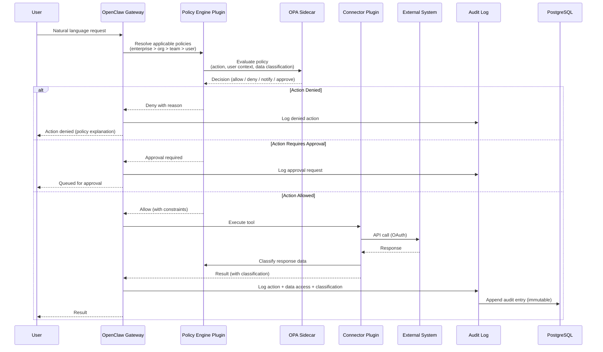
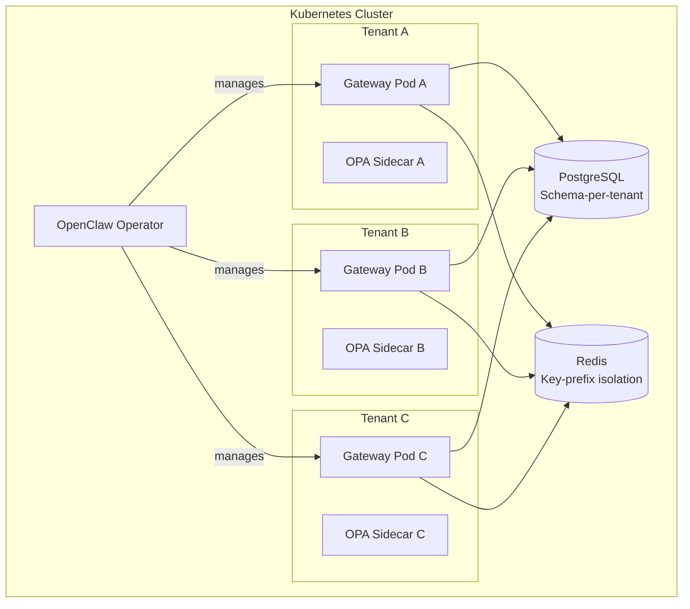

# Architecture Overview

OpenClaw Enterprise extends the OpenClaw Gateway with enterprise plugins, a policy sidecar, persistent storage, and a Kubernetes operator for lifecycle management. This page describes how these components fit together.

## System Architecture

The following diagram shows the high-level architecture of an OpenClaw Enterprise deployment:

```mermaid
graph TB
    subgraph "Kubernetes Cluster"
        subgraph "OpenClaw Enterprise Operator"
            OP[K8s Operator<br/>Go]
            CRD_I[OpenClawInstance CR]
            CRD_P[PolicyBundle CR]
        end

        subgraph "Tenant Gateway Pod"
            GW[OpenClaw Gateway<br/>Node.js 22+]

            subgraph "Enterprise Plugins"
                PE[Policy Engine]
                AE[Audit Enterprise]
                AUTH[Auth Enterprise]
                TI[Task Intelligence]
                AR[Auto-Response]
                WT[Work Tracking]
                OCIP[OCIP Protocol]
                OI[Org Intelligence]
                VIZ[Visualization]

                subgraph "Connectors"
                    CG[Gmail]
                    CC[GCal]
                    CJ[Jira]
                    CGH[GitHub]
                    CGD[GDrive]
                end
            end

            OPA[OPA Sidecar<br/>Policy Evaluation]
        end

        PG[(PostgreSQL<br/>State + Audit)]
        RD[(Redis<br/>Cache)]
    end

    subgraph "External Systems"
        GMAIL[Gmail API]
        GCAL[Google Calendar API]
        JIRA[Jira API]
        GITHUB[GitHub API]
        GDRIVE[Google Drive API]
        IDP[SSO/OIDC Provider]
    end

    USER[Knowledge Worker] --> GW
    ADMIN[Enterprise Admin] --> GW

    OP --> CRD_I
    OP --> CRD_P
    OP --> GW
    OP --> OPA

    GW --> PE
    PE --> OPA
    GW --> AE
    GW --> AUTH
    AUTH --> IDP

    CG --> GMAIL
    CC --> GCAL
    CJ --> JIRA
    CGH --> GITHUB
    CGD --> GDRIVE

    GW --> PG
    GW --> RD
    AE --> PG
```

## Plugin Dependency Layers

Enterprise plugins are organized in layers, where each layer depends on the layers below it. The shared library provides common types, constants, and utilities used by all plugins.

**Layer summary:**

| Layer | Plugins | Role |
|---|---|---|
| Foundation | `shared` | Common types, constants, error classes, connector base class, health checks |
| Core Services | `policy-engine`, `audit-enterprise`, `auth-enterprise` | Policy evaluation, immutable logging, SSO/OIDC authentication and RBAC |
| Connectors | `connector-gmail`, `connector-gcal`, `connector-jira`, `connector-github`, `connector-gdrive` | Abstraction over external systems with policy-governed access |
| Intelligence | `task-intelligence`, `auto-response`, `work-tracking`, `org-intelligence` | Cross-system task management, automated responses, work tracking, org news |
| Protocol | `ocip-protocol` | Agent-to-agent communication with classification enforcement |
| Presentation | `visualization` | D3.js interactive visualizations via OpenClaw Canvas |

## Request Data Flow

Every user request follows a consistent path through the system. Policy evaluation and audit logging are mandatory at every step.

## Multi-Gateway Tenancy Model

OpenClaw Enterprise uses a **multi-gateway tenancy model**: each tenant (organization or team, depending on configuration) gets its own OpenClaw Gateway instance. This provides strong isolation between tenants at the process level.

The Kubernetes operator manages the lifecycle of these gateway instances:

Each gateway instance:

- Runs its own set of enterprise plugins
- Has its own OPA sidecar loaded with tenant-specific policies
- Connects to PostgreSQL with schema-level isolation
- Uses Redis with key-prefix isolation for caching
- Is defined by an `OpenClawInstance` custom resource

The operator watches `OpenClawInstance` and `PolicyBundle` custom resources and reconciles the cluster state accordingly. It handles:

- Creating and updating gateway deployments
- Injecting OPA sidecars with the correct policy bundles
- Managing database migrations
- Rolling updates and health monitoring
- RBAC configuration for pod-level access control

## Kubernetes Operator and CRDs

The operator defines two custom resource types:

| CRD | Short Name | Purpose |
|---|---|---|
| `OpenClawInstance` | `oci` | Defines a deployed OpenClaw Enterprise instance (auth, storage, integrations, replicas) |
| `PolicyBundle` | `pb` | Defines a collection of Rego policies to load into the OPA sidecar |

The operator supports two deployment modes:

- **Single mode** (`deploymentMode: single`): one gateway replica, suitable for small teams
- **HA mode** (`deploymentMode: ha`): multiple gateway replicas behind a load balancer, suitable for larger deployments

## Storage Architecture

| Store | Technology | Data | Characteristics |
|---|---|---|---|
| Primary database | PostgreSQL 16+ | Tasks, policies, user preferences, connector state | Schema-per-tenant, encrypted at rest (AES-256) |
| Audit database | PostgreSQL 16+ (separate DB or schema) | Immutable audit entries | Append-only, no updates, no deletes, separate retention |
| Cache | Redis 7+ | Session data, policy cache, connector token cache | Key-prefix isolation per tenant, TTL-based expiry |
| Secrets | K8s Secrets or HashiCorp Vault | OAuth tokens, database credentials, OIDC client secrets | Never stored in configuration files |

!!! warning "No SQLite in production"
    OpenClaw Enterprise requires PostgreSQL for production deployments. SQLite is not supported for shared state or audit logging in any production configuration.

## What's Next

- [Key Concepts](concepts.md) -- learn the vocabulary used across the system
- [Quickstart Guide](quickstart.md) -- deploy OpenClaw Enterprise on Kubernetes
