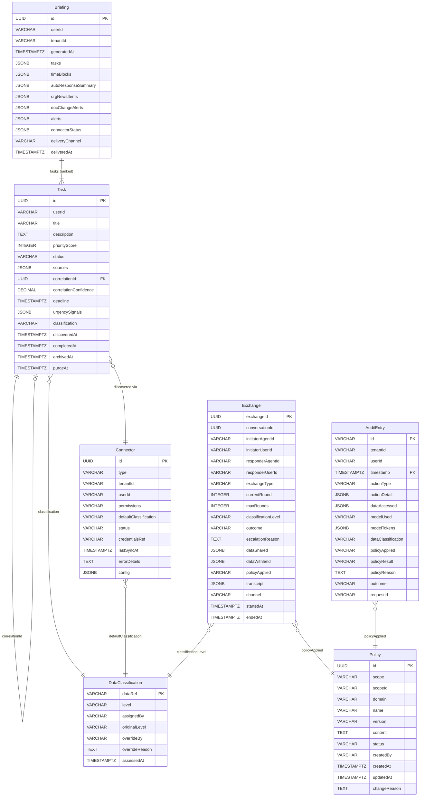

# OpenClaw Enterprise -- Data Model Reference

This document defines every data entity in the OpenClaw Enterprise system, including field types, validation constraints, retention policies, and relationships.

All entities are stored in PostgreSQL. The audit subsystem uses a separate PostgreSQL database with append-only constraints (see [ADR-006](./adr/006-append-only-audit.md)).

---

## Table of Contents

- [Policy](#policy)
- [Task](#task)
- [Connector](#connector)
- [AgentIdentity](#agentidentity)
- [Exchange](#exchange)
- [AuditEntry](#auditentry)
- [Briefing](#briefing)
- [DataClassification](#dataclassification)
- [Entity Relationship Diagram](#entity-relationship-diagram)
- [Database Indexes](#database-indexes)

---

## Policy

Policies define rules that govern system behavior across 7 domains. Policies are scoped hierarchically: enterprise > org > team > user. A lower scope can restrict but never expand permissions granted by a parent scope.

| Field | Type | Constraints | Description |
|-------|------|-------------|-------------|
| `id` | UUID | Primary key, auto-generated | Unique identifier |
| `scope` | VARCHAR(20) | `enterprise`, `org`, `team`, `user` | Hierarchy level at which this policy applies |
| `scopeId` | VARCHAR(255) | NOT NULL | Identifier of the scope target (e.g., org ID, team ID, user ID) |
| `domain` | VARCHAR(20) | `models`, `actions`, `integrations`, `agent-to-agent`, `features`, `data`, `audit` | Policy domain this rule governs |
| `name` | VARCHAR(255) | NOT NULL | Human-readable policy name |
| `version` | VARCHAR(50) | NOT NULL, must follow semver | Semantic version of this policy revision |
| `content` | TEXT | NOT NULL, YAML format | Policy definition in YAML |
| `status` | VARCHAR(20) | `draft`, `active`, `deprecated` (default: `draft`) | Lifecycle status |
| `createdBy` | VARCHAR(255) | NOT NULL | User ID of the policy author |
| `createdAt` | TIMESTAMPTZ | NOT NULL, auto-set | Creation timestamp |
| `updatedAt` | TIMESTAMPTZ | NOT NULL, auto-set | Last modification timestamp |
| `changeReason` | TEXT | NOT NULL | Explanation for the creation or most recent change |

**Validation Rules:**

- `version` must follow semantic versioning (e.g., `1.0.0`, `2.1.3`).
- A lower-scope policy cannot expand permissions beyond what the parent scope allows. For example, if the enterprise policy sets `max_classification: confidential`, an org-level policy cannot set `max_classification: restricted`.
- Hierarchy validation is enforced at write time by `PolicyHierarchyValidator`.

**Source:** `db/migrations/001_policies.sql`, `plugins/shared/src/types.ts`

---

## Task

Tasks represent work items discovered from connected systems (email, calendar, Jira, GitHub, Google Drive). Tasks are correlated across sources using multi-signal scoring.

| Field | Type | Constraints | Description |
|-------|------|-------------|-------------|
| `id` | UUID | Primary key | Unique identifier |
| `userId` | VARCHAR(255) | NOT NULL | Owner of this task |
| `title` | VARCHAR(255) | NOT NULL | Task title |
| `description` | TEXT | | Detailed description |
| `priorityScore` | INTEGER | 0--100 | Computed priority based on urgency signals |
| `status` | VARCHAR(20) | `discovered`, `active`, `completed`, `archived`, `purged` | Lifecycle status |
| `sources` | JSONB | Array of `{system, id, url}` | Source systems where this task was found |
| `correlationId` | UUID | Nullable, FK to Task | ID of the correlated/parent task if merged |
| `correlationConfidence` | DECIMAL | 0.0--1.0, nullable | Confidence score of the correlation match |
| `deadline` | TIMESTAMPTZ | Nullable | Task deadline if known |
| `urgencySignals` | JSONB | Object | Signals used for priority scoring |
| `classification` | VARCHAR(20) | `public`, `internal`, `confidential`, `restricted` | Data classification level |
| `discoveredAt` | TIMESTAMPTZ | NOT NULL | When the task was first discovered |
| `completedAt` | TIMESTAMPTZ | Nullable | When the task was marked complete |
| `archivedAt` | TIMESTAMPTZ | Nullable | When the task was archived |
| `purgeAt` | TIMESTAMPTZ | Nullable | Scheduled purge timestamp |

**Urgency Signals Object:**

| Field | Type | Description |
|-------|------|-------------|
| `senderSeniority` | number or null | Seniority level of the task requester |
| `followUpCount` | number | Number of follow-up messages about this task |
| `slaTimer` | string or null | ISO 8601 duration or timestamp for SLA |
| `blockingRelationships` | string[] | IDs of tasks/items this task is blocking |

**Retention Policy:**

| Phase | Duration | Trigger |
|-------|----------|---------|
| Active | 90 days | From `discoveredAt` |
| Archived | 30 days after completion | Task moves to `archived` status |
| Purged | 90 days after archival | Task data is permanently deleted |

**Correlation Thresholds:**

| Score Range | Action |
|-------------|--------|
| >= 0.8 | Auto-merge as duplicate |
| 0.5 -- 0.8 | Flag as "possibly related" for human review |
| < 0.5 | Treat as separate tasks |

**Source:** `db/migrations/002_tasks.sql`, `plugins/shared/src/types.ts`, `plugins/shared/src/constants.ts`

---

## Connector

Connectors represent authenticated connections to external systems.

| Field | Type | Constraints | Description |
|-------|------|-------------|-------------|
| `id` | UUID | Primary key | Unique identifier |
| `type` | VARCHAR(20) | `gmail`, `gcal`, `jira`, `github`, `gdrive` | Connector type |
| `tenantId` | VARCHAR(255) | NOT NULL | Tenant that owns this connector |
| `userId` | VARCHAR(255) | Nullable | User-level connector (null = tenant-wide) |
| `permissions` | VARCHAR(10) | `read`, `write`, `admin` (default: `read`) | Access level granted to the connector |
| `defaultClassification` | VARCHAR(20) | `public`, `internal`, `confidential`, `restricted` | Default classification for data from this connector |
| `status` | VARCHAR(20) | `active`, `disabled`, `error` | Current connector status |
| `credentialsRef` | VARCHAR(255) | NOT NULL | Reference to credentials in secret store |
| `lastSyncAt` | TIMESTAMPTZ | Nullable | Last successful synchronization timestamp |
| `errorDetails` | TEXT | Nullable | Error message if status is `error` |
| `config` | JSONB | | Connector-specific configuration |

**Default Classification by Connector Type:**

| Connector | Default Classification |
|-----------|----------------------|
| `gmail` | `internal` |
| `gcal` | `internal` |
| `jira` | `internal` |
| `github` | `public` |
| `gdrive` | `internal` |

**Source:** `db/migrations/003_connectors.sql`, `plugins/shared/src/types.ts`, `plugins/shared/src/constants.ts`

---

## AgentIdentity

AgentIdentity describes the capabilities and constraints of an OpenClaw agent instance. Agent identities are derived from policies at runtime, not stored directly.

| Field | Type | Constraints | Description |
|-------|------|-------------|-------------|
| `instanceId` | string | Required | Unique agent instance identifier |
| `userId` | string | Required | User this agent acts on behalf of |
| `tenantId` | string | Required | Tenant the agent belongs to |
| `orgUnit` | string | Required | Organizational unit within the tenant |
| `canReceiveQueries` | boolean | Required | Whether this agent accepts incoming queries |
| `canAutoRespond` | boolean | Required | Whether this agent can auto-respond without human approval |
| `canMakeCommitments` | boolean | Always `false` unless human approves | Whether the agent can make commitments on behalf of the user |
| `maxClassificationShared` | DataClassificationLevel | Required | Maximum classification level this agent may share externally |
| `supportedExchangeTypes` | ExchangeType[] | Required | Exchange types this agent can participate in |
| `maxRoundsAccepted` | number | Required | Maximum conversation rounds before escalation |

**Important:** `canMakeCommitments` is always `false` for agent-generated messages. A human must explicitly approve any commitment before it can be made. This is enforced by the OCIP commitment detector.

**Note:** AgentIdentity also includes a `humanAvailability` field at the application layer that indicates whether the user is currently online, away, or offline, used to determine auto-response behavior.

**Source:** `plugins/shared/src/types.ts`

---

## Exchange

Exchanges track structured agent-to-agent conversations via the OCIP protocol.

| Field | Type | Constraints | Description |
|-------|------|-------------|-------------|
| `exchangeId` | UUID | Primary key | Unique exchange identifier |
| `conversationId` | UUID | NOT NULL | Groups related exchanges into a conversation |
| `initiatorAgentId` | VARCHAR(255) | NOT NULL | Agent instance that initiated the exchange |
| `initiatorUserId` | VARCHAR(255) | NOT NULL | User behind the initiating agent |
| `responderAgentId` | VARCHAR(255) | NOT NULL | Agent instance responding to the exchange |
| `responderUserId` | VARCHAR(255) | NOT NULL | User behind the responding agent |
| `exchangeType` | VARCHAR(30) | `information_query`, `commitment_request`, `meeting_scheduling` | Type of exchange |
| `currentRound` | INTEGER | >= 0 | Current message round in the exchange |
| `maxRounds` | INTEGER | Default: 3 | Maximum rounds before mandatory escalation |
| `classificationLevel` | VARCHAR(20) | `public`, `internal`, `confidential`, `restricted` | Highest classification of data in this exchange |
| `outcome` | VARCHAR(20) | `in_progress`, `resolved`, `escalated`, `denied`, `expired` | Current exchange outcome |
| `escalationReason` | TEXT | Nullable | Reason for escalation to human |
| `dataShared` | JSONB | Array of `{source, fields[]}` | Data items shared during the exchange |
| `dataWithheld` | JSONB | Array of `{reason, description}` | Data items withheld and why |
| `policyApplied` | VARCHAR(255) | NOT NULL | Policy that governed this exchange |
| `transcript` | JSONB | Array of objects | Full message transcript |
| `channel` | VARCHAR(50) | NOT NULL | Communication channel used |
| `startedAt` | TIMESTAMPTZ | NOT NULL | Exchange start time |
| `endedAt` | TIMESTAMPTZ | Nullable | Exchange end time (null if in progress) |

**Source:** `db/migrations/005_exchanges.sql`, `plugins/shared/src/types.ts`

---

## AuditEntry

Audit entries form a tamper-evident, append-only log of all significant system actions. Stored in a separate PostgreSQL database, partitioned by month.

| Field | Type | Constraints | Description |
|-------|------|-------------|-------------|
| `id` | VARCHAR(26) | ULID, part of composite PK | Unique identifier (ULID for time-ordered IDs) |
| `tenantId` | VARCHAR(255) | NOT NULL | Tenant context |
| `userId` | VARCHAR(255) | NOT NULL | User who performed the action |
| `timestamp` | TIMESTAMPTZ | NOT NULL, part of composite PK | When the action occurred |
| `actionType` | VARCHAR(30) | One of 6 types (see below) | Category of action |
| `actionDetail` | JSONB | Default: `{}` | Structured details about the action |
| `dataAccessed` | JSONB | Default: `[]` | Array of `{source, classification, purpose}` records |
| `modelUsed` | VARCHAR(255) | Nullable | AI model identifier if a model was invoked |
| `modelTokens` | JSONB | Nullable, `{input, output}` | Token counts for model calls |
| `dataClassification` | VARCHAR(20) | `public`, `internal`, `confidential`, `restricted` | Highest classification of data involved |
| `policyApplied` | VARCHAR(255) | NOT NULL | Policy that was evaluated |
| `policyResult` | VARCHAR(20) | `allow`, `deny`, `require_approval` | Policy decision |
| `policyReason` | TEXT | Default: `''` | Human-readable explanation of the policy decision |
| `outcome` | VARCHAR(20) | `success`, `denied`, `error`, `pending_approval` | Final outcome of the action |
| `requestId` | VARCHAR(255) | NOT NULL | Correlation ID for request tracing |

**Action Types:**

| Action Type | Description |
|-------------|-------------|
| `tool_invocation` | A tool was called by the agent |
| `data_access` | Data was read from a connected system |
| `model_call` | An AI model was invoked |
| `policy_decision` | A policy evaluation was performed |
| `agent_exchange` | An agent-to-agent OCIP exchange occurred |
| `policy_change` | A policy was created, updated, or deprecated |

**Storage Properties:**

- **Append-only**: UPDATE and DELETE are blocked by database triggers.
- **Monthly partitioned**: Table is partitioned by `timestamp` using `PARTITION BY RANGE`. Partitions are created for 12 months ahead.
- **Retention**: 1-year minimum retention. Old partitions can be archived or dropped.
- **GDPR compliance**: Achieved via anonymization of user identifiers, not deletion of audit records.

**Source:** `db/migrations/004_audit_entries.sql`, `plugins/shared/src/types.ts`

---

## Briefing

Daily briefings aggregate tasks, calendar blocks, auto-response summaries, organization news, and system alerts for a user.

| Field | Type | Constraints | Description |
|-------|------|-------------|-------------|
| `id` | UUID | Primary key | Unique identifier |
| `userId` | VARCHAR(255) | NOT NULL | User this briefing is for |
| `tenantId` | VARCHAR(255) | NOT NULL | Tenant context |
| `generatedAt` | TIMESTAMPTZ | NOT NULL | When the briefing was generated |
| `tasks` | JSONB | Array of `{taskId, rank}` | Priority-ranked task list |
| `timeBlocks` | JSONB | Array of `{start, end, taskId, label}` | Suggested time blocks for the day |
| `autoResponseSummary` | JSONB | Object | Summary of auto-responses sent on behalf of the user |
| `orgNewsItems` | JSONB | Array of `{title, relevance, source}` | Organization news items with relevance scoring |
| `docChangeAlerts` | JSONB | Array of `{docId, summary, impact}` | Alerts about changed documents relevant to the user |
| `alerts` | JSONB | Array of `{type, message, severity}` | System and workflow alerts |
| `connectorStatus` | JSONB | Map of ConnectorType to status | Health status of each connector |
| `deliveryChannel` | VARCHAR(20) | `slack`, `email`, `web_ui` | How the briefing was delivered |
| `deliveredAt` | TIMESTAMPTZ | Nullable | When the briefing was delivered (null if pending) |

**News Relevance Levels:**

| Level | Description |
|-------|-------------|
| `must-read` | Critical news the user must see |
| `should-read` | Important news relevant to the user's role |
| `nice-to-know` | Informational, not urgent |
| `skip` | Filtered out, not included in briefing |

**Connector Status Values:** `ok`, `partial`, `error`, `unreachable`

**Source:** `db/migrations/006_briefings.sql`, `plugins/shared/src/types.ts`

---

## DataClassification

Tracks the classification level assigned to every piece of data, including the assignment method and any overrides.

| Field | Type | Constraints | Description |
|-------|------|-------------|-------------|
| `dataRef` | VARCHAR(255) | Primary key | Reference to the data item |
| `level` | VARCHAR(20) | `public`, `internal`, `confidential`, `restricted` | Current classification level |
| `assignedBy` | VARCHAR(30) | `connector_default`, `ai_reclassification`, `admin_override` | How the classification was assigned |
| `originalLevel` | VARCHAR(20) | Nullable | Original classification before reclassification or override |
| `overrideBy` | VARCHAR(255) | Nullable | User ID of the admin who performed the override |
| `overrideReason` | TEXT | Nullable | Reason for the admin override |
| `assessedAt` | TIMESTAMPTZ | NOT NULL | When the classification was last assessed |

**Classification Levels (lowest to highest sensitivity):**

| Level | Order | Description |
|-------|-------|-------------|
| `public` | 0 | Publicly available information |
| `internal` | 1 | Internal company information |
| `confidential` | 2 | Sensitive business information |
| `restricted` | 3 | Highly sensitive, strictly controlled access |

**Three-Layer Classification Process:**

1. **Connector default**: Baseline classification set by the connector type (see [Connector defaults](#connector)).
2. **AI reclassification**: AI model reviews content and may **upgrade** (never downgrade) the classification if sensitive content is detected.
3. **Admin override**: Human administrators can set any classification level, overriding both connector defaults and AI reclassification.

**Source:** `db/migrations/007_data_classifications.sql`, `plugins/shared/src/types.ts`

---

## Entity Relationship Diagram

---

## Database Indexes

The following indexes are defined across the schema migrations to support common query patterns.

| Table | Index Name | Columns | Purpose |
|-------|-----------|---------|---------|
| `policies` | `idx_policies_scope_domain` | `scope, scope_id, domain, status` | Policy lookup by scope hierarchy and domain |
| `policies` | `idx_policies_status` | `status` | Filter policies by lifecycle status |
| `audit.audit_entries` | `idx_audit_tenant_user_ts` | `tenant_id, user_id, timestamp DESC` | Audit queries filtered by tenant + user with time ordering |
| `audit.audit_entries` | `idx_audit_tenant_action_ts` | `tenant_id, action_type, timestamp DESC` | Audit queries filtered by tenant + action type with time ordering |
| `audit.audit_entries` | `idx_audit_request_id` | `request_id` | Request tracing correlation |

**Partitioning:**

- `audit.audit_entries` is partitioned by `RANGE (timestamp)` with monthly partitions. Partitions are named `audit_entries_YYYY_MM` (e.g., `audit_entries_2026_03`).
- Partition pruning is automatic for queries that include a `timestamp` filter.

**Source:** `db/migrations/001_policies.sql`, `db/migrations/004_audit_entries.sql`
