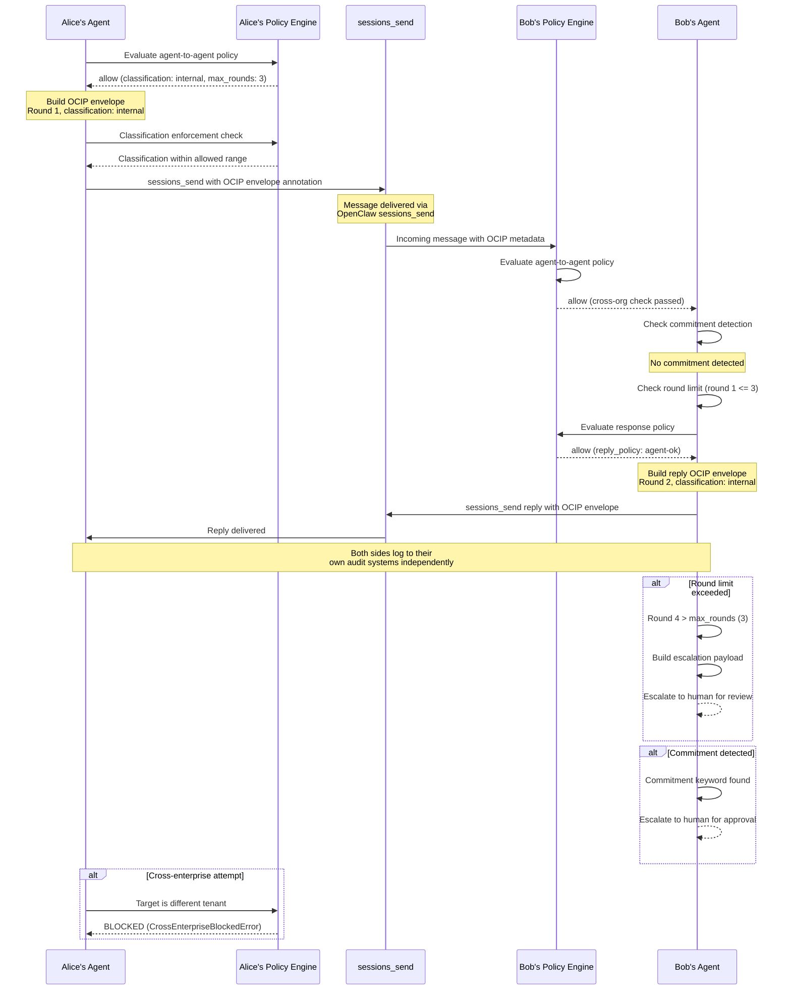

# OpenClaw Enterprise -- OCIP Protocol Reference

The OpenClaw Interchange Protocol (OCIP) defines how OpenClaw agent instances communicate with each other in a structured, policy-governed manner. OCIP is implemented as structured annotations on OpenClaw's existing `sessions_send` messages (see [ADR-007](./adr/007-ocip-via-sessions-send.md)).

---

## Table of Contents

- [Overview](#overview)
- [Envelope Format](#envelope-format)
- [Exchange Semantics](#exchange-semantics)
- [Classification Enforcement](#classification-enforcement)
- [Loop Prevention](#loop-prevention)
- [Commitment Detection](#commitment-detection)
- [Cross-Org and Cross-Enterprise Rules](#cross-org-and-cross-enterprise-rules)
- [Reply Policies](#reply-policies)
- [Dual-Sided Logging](#dual-sided-logging)
- [AI Disclosure](#ai-disclosure)
- [Message Flow Diagram](#message-flow-diagram)

---

## Overview

OCIP enables agent-to-agent communication within an enterprise while enforcing:

- **Classification boundaries**: Data cannot be shared above the sender's maximum classification level.
- **Commitment controls**: Agents cannot make commitments without human approval.
- **Loop prevention**: Conversations are bounded by a round limit with mandatory human escalation.
- **Cross-org governance**: Policy controls whether agents in different org units can communicate.
- **Cross-enterprise blocking**: Communication between different tenants is unconditionally blocked.

**Protocol Version:** `1.0`

**Transport:** `sessions_send` message annotations (not a custom transport layer)

**Default Max Rounds:** 3

---

## Envelope Format

Every outgoing OCIP message carries an `OcipEnvelope` as structured metadata on the `sessions_send` call.

| Field | Type | Required | Description |
|-------|------|----------|-------------|
| `version` | string | Yes | Protocol version (currently `"1.0"`) |
| `message_type` | string | Yes | `agent-generated`, `agent-assisted`, or `human` |
| `source_agent` | object | Yes | Identity of the sending agent |
| `source_agent.instance_id` | string | Yes | Unique agent instance identifier |
| `source_agent.user_id` | string | Yes | User the agent acts on behalf of |
| `source_agent.org_unit` | string | Yes | Organizational unit of the sender |
| `source_agent.tenant_id` | string | Yes | Tenant the sender belongs to |
| `classification` | string | Yes | Classification level of this message (`public`, `internal`, `confidential`, `restricted`) |
| `conversation_id` | string | Yes | UUID grouping messages into a conversation |
| `exchange_round` | integer | Yes | Current round number in the conversation |
| `max_rounds` | integer | Yes | Maximum rounds before mandatory escalation (default: 3) |
| `capabilities` | object | Yes | Sender's capabilities |
| `capabilities.can_commit` | boolean | Yes | Always `false` for agent-generated messages |
| `capabilities.can_share` | string[] | Yes | Classification levels the sender is permitted to share |
| `reply_policy` | string | Yes | `agent-ok`, `human-only`, or `no-reply-needed` |
| `requires_commitment` | boolean | Yes | Whether this exchange requires a commitment from the responder |
| `expires_at` | string | Yes | ISO 8601 timestamp after which the exchange expires (default: 24 hours) |

### Example Envelope

```json
{
  "version": "1.0",
  "message_type": "agent-generated",
  "source_agent": {
    "instance_id": "agent-abc-123",
    "user_id": "alice",
    "org_unit": "engineering",
    "tenant_id": "acme-corp"
  },
  "classification": "internal",
  "conversation_id": "conv-789-xyz",
  "exchange_round": 1,
  "max_rounds": 3,
  "capabilities": {
    "can_commit": false,
    "can_share": ["public", "internal"]
  },
  "reply_policy": "agent-ok",
  "requires_commitment": false,
  "expires_at": "2026-03-14T10:00:00.000Z"
}
```

---

## Exchange Semantics

Each exchange is classified by type, which determines reply policies and commitment requirements.

### Exchange Types

| Type | Description | Reply Policy | Requires Commitment | Example |
|------|-------------|-------------|---------------------|---------|
| `information_query` | Request for information, no action required | `agent-ok` | No | "What is the status of ticket ENG-1234?" |
| `commitment_request` | Request involving a commitment or obligation | `agent-ok` | Yes | "Can you allocate 2 engineers to Project X?" |
| `meeting_scheduling` | Request to schedule a meeting | `human-only` | Yes | "Can we schedule a design review for Thursday?" |

### Exchange Outcomes

| Outcome | Description |
|---------|-------------|
| `in_progress` | Exchange is active, messages are being exchanged |
| `resolved` | Exchange completed successfully |
| `escalated` | Exchange was escalated to a human (round limit, commitment, or error) |
| `denied` | Exchange was denied by policy |
| `expired` | Exchange expired before resolution |

---

## Classification Enforcement

Classification enforcement happens at the **sender side** before any message is transmitted.

### Enforcement Rules

1. The sender's agent identity specifies `maxClassificationShared`.
2. The `capabilities.can_share` array in the envelope lists all classification levels from `public` up to and including `maxClassificationShared`.
3. The message `classification` field must not exceed the sender's `maxClassificationShared`.
4. If the message content contains data classified above the allowed level, the message is blocked and the exchange is denied.

### Classification Level Order

```
public (0) < internal (1) < confidential (2) < restricted (3)
```

### Example

If an agent's `maxClassificationShared` is `internal`:
- `can_share` will be `["public", "internal"]`
- Messages classified as `public` or `internal` are permitted
- Messages classified as `confidential` or `restricted` are blocked

---

## Loop Prevention

OCIP prevents unbounded agent-to-agent conversations through a round counter mechanism.

### Mechanism

1. When an exchange starts, the round counter is initialized to 0 with a configured `max_rounds` (default: 3).
2. Every message in the conversation increments `exchange_round` by 1.
3. When `exchange_round > max_rounds`, the exchange **must** escalate to humans.
4. There is no mechanism to extend `max_rounds` within an active exchange.

### Escalation Payload

When the round limit is reached, an escalation payload is generated for human review:

```json
{
  "exchangeId": "exch-001",
  "conversationId": "conv-789-xyz",
  "currentRound": 4,
  "maxRounds": 3,
  "conversationSummary": "Round 1 (agent-alice): Requested project status\nRound 2 (agent-bob): Provided status update\nRound 3 (agent-alice): Asked follow-up question\nRound 4 (agent-bob): Provided additional context",
  "reason": "Exchange reached maximum round limit (3). Human review required."
}
```

### Transcript Tracking

Each round is tracked in the exchange state:

```json
{
  "exchangeId": "exch-001",
  "conversationId": "conv-789-xyz",
  "currentRound": 2,
  "maxRounds": 3,
  "transcript": [
    { "round": 1, "sender": "agent-alice", "summary": "Requested project status" },
    { "round": 2, "sender": "agent-bob", "summary": "Provided status update" }
  ]
}
```

---

## Commitment Detection

OCIP enforces that agents cannot make commitments on behalf of users without explicit human approval.

### Detection Signals

Commitment detection uses two signal types:

**1. Explicit flags in the envelope:**

| Signal | Condition | Result |
|--------|-----------|--------|
| `requires_commitment: true` | Set by exchange type | Escalate to human |
| `reply_policy: "human-only"` | Set for meeting scheduling | Escalate to human |

**2. Keyword detection in message content:**

The following keywords in message content trigger commitment detection:

| Keywords |
|----------|
| `schedule`, `meeting`, `agree`, `approve`, `allocate`, `assign`, `reserve`, `commit`, `confirm`, `book`, `deadline`, `promise`, `guarantee` |

### Enforcement

- If any commitment signal is detected, the exchange is escalated to a human for approval.
- `capabilities.can_commit` is always `false` in agent-generated envelopes.
- The `CommitmentDetector` throws a `CommitmentRequiresHumanError` when enforcement is active.

### Detection Result

```typescript
interface CommitmentDetectionResult {
  requiresHuman: boolean;
  reason: string | null;
  detectedKeywords: string[];
}
```

---

## Cross-Org and Cross-Enterprise Rules

### Intra-Enterprise, Same Org Unit

- **Always allowed.** No additional policy checks.

### Intra-Enterprise, Cross-Org Unit

- **Allowed if policy permits.** The `agent-to-agent` policy domain must have `cross_org: true`.
- A policy evaluation is performed with action `agent_exchange_cross_org`, passing `sourceOrgUnit` and `targetOrgUnit` in the context.
- If the policy denies the exchange, the exchange is rejected.

### Cross-Enterprise (Different Tenants)

- **Blocked unconditionally.** No policy can override this restriction.
- Throws `CrossEnterpriseBlockedError` immediately.
- This is enforced before any other checks.

### Quick Reference

| Source Tenant | Target Tenant | Source Org | Target Org | Result |
|--------------|---------------|-----------|-----------|--------|
| acme-corp | acme-corp | engineering | engineering | Allowed |
| acme-corp | acme-corp | engineering | marketing | Policy check (`cross_org`) |
| acme-corp | globex-inc | any | any | **Blocked** |

---

## Reply Policies

Reply policies control who is allowed to respond to an OCIP message.

| Policy | Description | Use Case |
|--------|-------------|----------|
| `agent-ok` | Agent can auto-respond without human involvement | Information queries, routine exchanges |
| `human-only` | Only a human can respond; agent must escalate | Meeting scheduling, commitments, sensitive decisions |
| `no-reply-needed` | No response expected | Notifications, status updates |

### Reply Policy by Exchange Type

| Exchange Type | Default Reply Policy |
|---------------|---------------------|
| `information_query` | `agent-ok` |
| `commitment_request` | `agent-ok` (but commitment detection still escalates) |
| `meeting_scheduling` | `human-only` |

---

## Dual-Sided Logging

Both sides of an OCIP exchange log independently to their own audit systems.

### Sender-Side Logging

- Logs the outgoing message with: exchange ID, conversation ID, classification, policy applied, data shared.
- Audit action type: `agent_exchange`.

### Receiver-Side Logging

- Logs the incoming message with: exchange ID, conversation ID, classification, policy applied, data withheld (if any).
- Audit action type: `agent_exchange`.

### Data Tracking

Each exchange records:

| Field | Description |
|-------|-------------|
| `dataShared` | Array of `{source, fields[]}` -- what data was included in messages |
| `dataWithheld` | Array of `{reason, description}` -- what data was withheld and why |

This enables full auditing of what information was exchanged, shared, or protected during each conversation.

---

## AI Disclosure

All agent-generated messages carry a disclosure label:

```
Sent by user's OpenClaw assistant
```

This label is attached to every outgoing message where `message_type` is `agent-generated` or `agent-assisted`, ensuring recipients know they are communicating with an AI agent.

---

## Message Flow Diagram



---

## Source Files

| Component | File |
|-----------|------|
| Envelope builder | `plugins/ocip-protocol/src/envelope/builder.ts` |
| Envelope parser | `plugins/ocip-protocol/src/envelope/parser.ts` |
| Commitment detector | `plugins/ocip-protocol/src/envelope/commitment.ts` |
| Classification filter | `plugins/ocip-protocol/src/classification/filter.ts` |
| Cross-org checker | `plugins/ocip-protocol/src/classification/cross-org.ts` |
| Loop prevention counter | `plugins/ocip-protocol/src/loop-prevention/counter.ts` |
| Exchange logger | `plugins/ocip-protocol/src/exchange-log/logger.ts` |
| Exchange gateway | `plugins/ocip-protocol/src/exchange-log/gateway.ts` |
| Agent-exchange Rego policy | `plugins/policy-engine/rego/agent-exchange.rego` |
| Shared types | `plugins/shared/src/types.ts` |
| Constants | `plugins/shared/src/constants.ts` |
